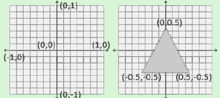

# learning-opengl
For other projects, I decided to learn OpenGL by going along with this: https://learnopengl.com/
Most of the notes are either taken from the pdf or interpreted from stuff taken from the pdf.
---

## 2. OpenGL

### Tips:
- Update video card drivers

### Warnings:
- Newer versions of OpenGL targets most modern graphics cards so most target lower versions

---

## 3. Prepping to create a window

### GLFW:
Library in C giving us bare necessities required for rendering goodies to the screen. Allows us to create an OpenGL context, define window parameters, and handle user input.

- Downloaded the GLFW binary
- Installed CMake
- Built the GLFW binary with CMake
- Opened the generated GLFW solution in VS and built the solution
- Extracted the desired include and libs for a specific opengl header content ressource
- Added the references to the inlcude and library to a project + the dependencies to glfw3.lib and opengl32.lib

### GLAD:
Library that saves us time and headaches with functions declarations.

Just followed 3.5 similarly to the GLFW section.

---

## 4. Creating a window

Including glad goes before glfw3 as the second requires the first.

--- 

## 5. Triangle
OpenGL is about transforming 3D coordinates to 2D pixels that fit on our screen. 
This is managed by the graphics pipeline of OpenGL.

### Shaders:
Small programs run on the GPU by the processing cores for each step of the pipeline.

### GLSL:
OpenGL Shading Language used to write shaders.

### Vertex:
A collection of data per 3D coordinate. Vertex data is represented using vertex attributes that can contain data.
(Or also just 3D position with some color value)

OpenGL requires you to hint what kind of render types you want to form with the data (ex: collection of points, triangales, one long line ...).
Those hints are called primitives and are given to OpenGL with any drawing commands. Some hits: GL_POINTS, GL_TRIANGLES and GL_LINE_STRIP.

### The pipeline:
#### 1 - Vertex shader
Takes a single vertex as input. Main purpose is to transform 3D coordinates into different 3D coordinates. Allows for basic processing on the vertex.

#### 2 - Primitive assembly
Takes all the vertices from the vertex shader that form a primitive and assembles all the points, in this example: a triangle.

#### 3 - Geometry shader
Takes the output of the primitive assembly for a collection of vertices as input with the ability to generate other shapes by creating new shapes or primitives.
In this example: a second triangle out of the given shape.

#### 4 - Rasterization stage
Mapping of the resulting primitive(s) to the corresponding pixels on the screen resutling in fragments for the fragment shader to use.

#### 5 - Clipping
Clipping discards all fragments that are outside your view, increasing performance.

A fragment in OpenGL is all the data required for OpenGL to render a single pixel.

#### 6 - Fragment shader
Calculate the final color of a pixel. Contains data about the 3D scene to calculate (light, shadows, colors of lights etc).

#### 7 - Alpha test and Blending
Checks the corresponding depth value of the fragment to check if it's in front or behind another object and should be discarded.
Also checks alpha values (opacity of an object) and blends the object accordingly.

### Modern OpenGL
Requires to define at least a vertex and a fragment shader of our own since there are none by default. This is why it's easier to learn OpenGL with older versions.

### Normalized Device Coordinates (NDC)
The 0,0 is at the center of the graph

### Vertex Buffer Objects (VBO)
Objects that can store a large number of vertices in the GPU's memory. We use it to store our coordinates and send as inputs to the first step (vertex shaders).

### Vertex Attribute Object
...

We got a triangle! 
